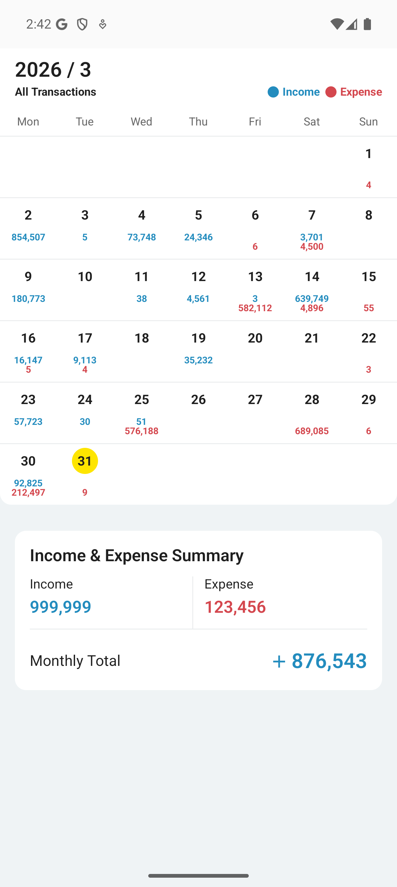

# ComposeFinanceCalendar

A Jetpack Compose library for displaying monthly transaction calendars with per-day income/expense breakdowns and summary totals.

<p align="center">
  
</p>

## Installation

Add JitPack to `settings.gradle.kts`:

```kotlin
repositories {
    maven { url = uri("https://jitpack.io") }
}
```

Add the dependency:

```kotlin
implementation("com.github.robert0ng:ComposeFinanceCalendar:1.0.0")
```

**Requirements:** Min SDK 24 | Kotlin 1.9+ | Compose BOM 2024.01.00+

## Quick Start

```kotlin
// Prepare date range and per-day data
val start = YearMonth.of(2024, Month.MAY).atDay(1)
val end = YearMonth.of(2024, Month.MAY).atEndOfMonth()
val dateRange = start.toLong()..end.toLong()

val dayData = mapOf(
    LocalDate.of(2024, 5, 1) to Pair("36,000", "18,600"),
    LocalDate.of(2024, 5, 15) to Pair("2,000", ""),
)

val calendarDays = toCalendarDays(
    range = dateRange,
    startOfWeek = DayOfWeek.MONDAY,
    dayData = dayData
)

// Render
CalendarScreen(
    dateRange = dateRange,
    calendarDays = calendarDays,
    totalIncome = "38,000",
    totalExpense = "18,600",
    totalAmount = "19,400",
    onDayClicked = { day -> }
)
```

## Components

| Component | Description |
|-----------|-------------|
| `CalendarScreen` | Full-page orchestrator composing header + grid + summary |
| `CalendarHeader` | Year/month title with income/expense legend |
| `CalendarView` | 7-column calendar grid with per-day amounts |
| `TotalSummaryView` | Income/expense/net summary card |

All components accept `CalendarColors` and `CalendarStrings` for customization.

## Customization

### Colors

```kotlin
CalendarColors(
    incomeColor = Color(0xFF4CAF50),
    expenseColor = Color(0xFFF44336),
    todayHighlightColor = Color(0xFFFFEB3B)
)
```

### Localization

```kotlin
CalendarStrings(
    headerTitle = { y, m -> "${y}年${m}月" },
    incomeLabel = "收入",
    expenseLabel = "支出",
    summaryTitle = "本月收支總覽",
    monthlyTotalLabel = "本月合計",
    weekdayNames = listOf("一", "二", "三", "四", "五", "六", "日")
)
```

### Icons

`CalendarHeader` and `TotalSummaryView` accept an optional `icon` composable slot.

## Sample App

```bash
./gradlew :sample:installDebug
```

## Publishing

This project is configured for [JitPack](https://jitpack.io). Push to GitHub, tag a release, and it builds automatically:

```bash
git tag v1.0.0 && git push --tags
```

## License

Apache 2.0 - See [LICENSE](LICENSE) for details.
